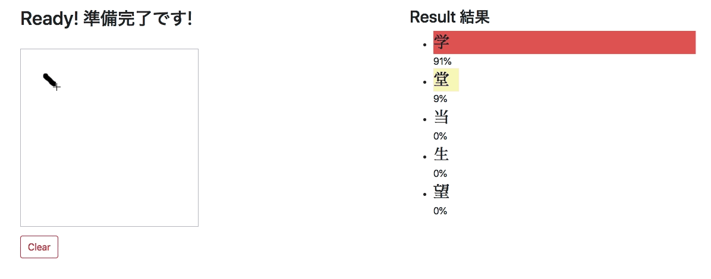

# Japanese Characters Recognizer
## Demo

<a href="https://yutsu.github.io/kanji_hiragana_CNN/">Demo site</a>

**Note**:

* Might not work with Safari. Please use Chrome.
* It coult take a minute to load data.

## What it does
This application will detect the Japanese character written in the box. It does not support katakana yet.

## How did I create this app

* I used the Japanese handwritten character dataset available at <a href="http://etlcdb.db.aist.go.jp">etlcdb</a>.

* A 5 layers sequential Convolutional Neural Network (CNN) model was used with keras API.

* Converted the model using <code>tensorflowjs_converter</code> for web.

